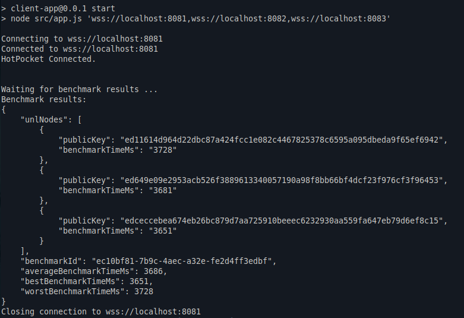

# alive4ever

A proof of concept to explore long running processes alongside an [Evernode](https://evernode.org) smart contract.

## Disclaimer

This is a Proof of Concept (PoC) only. **It is not intended for production use.** Exception handling and security measures have been omitted to keep the code simple and easy to understand. The goal is to demonstrate core technical concepts and functionality as a starting point for further research, development and learning.

## Description

This set of three projects demonstrates how an Evernode smart contract can:

1. Start a new detached process inside the Docker container it is running in
2. Have that process feed results back into the smart contract

The projects use a simple CPU benchmarking application as an example. Here's how it works:

1. The client application requests a cluster to perform a CPU benchmark on its UNL instances.
2. The smart contract starts the benchmarking app for each UNL (Unique Node List) node of the cluster
3. On each node the app measures the execution time of the CPU benchmark
4. The results are fed back into the smart contract
5. The smart contract consolidates all the results
6. It then reports the overall outcome back to the client application

## Benefits of this Approach

-   Allows smart contracts to perform complex, time-consuming tasks off-chain in detached processes
-   Demonstrates a pattern for aggregating results from multiple nodes
-   Provides a template for building powerful, distributed smart contract applications

## Conclusion

The project showcases some of the remarkable features of Evernode smart contracts, which go far beyond simple on-chain logic. By seamlessly integrating detached processes and aggregation, developers can now build highly scalable and capable decentralized applications (dApps) that push the boundaries of what's possible in the blockchain space.

## Usage Instructions

### Local `hpdevkit` [Evernode](https://evernode.org) Cluster

-   Clone the repository.
-   `cd` into each of the 3 project directories and run `npm install`.
-   `cd` into `smart-contract` directory and run `npm build`.
-   `cd` into `benchmark-app` directory and run `npm run prepare`. (This will build the benchmark app and copy the self-contained file into the `dist/` directory of `smart-contract` project. Do this every time after changes were made to the `benchmark-app`.)
-   With a new console window, `cd` into `smart-contract`, run `npm start`.
-   With another console window, `cd` into `client-app`, run `npm start`. (Look into `package.json`: The `start` script will use all the default nodes as connection servers. That's important for local usage, since DNS wouldn't help the `benchmark-app` to connect to the cluster.)
-   Wait a few seconds until results show up in the console window.

### [Evernode](https://evernode.org) Cluster on [XAHAU](https://xahau.network/) Mainnet

-   Clone the repository.
-   `cd` into each of the 3 project directories and run `npm install`.
-   `cd` into `smart-contract` directory and run `npm build`.
-   `cd` into `benchmark-app` directory and run `npm run prepare`. (This will build the benchmark app and copy the self-contained file into the `dist/` directory of `smart-contract` project. Do this every time after changes were made to the `benchmark-app`.)
-   Deploy the smart contract to an [Evernode](https://evernode.org) instance or cluster. Click here for instructions how to do that: [Single instance](https://docs.evernode.org/en/latest/sdk/evernode/tutorials/deploy-single.html), [Cluster](https://docs.evernode.org/en/latest/sdk/evernode/tutorials/deploy-cluster.html)
-   With another console window, `cd` into `client-app`, `node src/app.js <wss-url:port_of_an_instance>`. (Here a single wss-URL of the cluster should be enough, since it should be accessible for every member of the cluster.)
-   Wait a few seconds until results show up in the console window.

## Client Application Example Output

